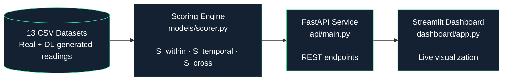

# Iomt_Reliability

#  IoMT Reliability Scoring System

A production-style FastAPI + Streamlit system for statistical reliability scoring of IoMT pulse oximeter data, distinguishing normal operation from 12 device-anomaly, patient-anomaly, and cyberattack conditions using real sensor data.

<<<<<<< HEAD
** Live Dashboard:** [https://shruti-b-29-iomt-reliability-dashboardapp-24nzlj.streamlit.app/]
=======
**🔗 Live API Docs:** [http://localhost:8000/docs#/default/score_all_conditions_score_all_get] · **🔗 Live Dashboard:** [https://shruti-b-29-iomt-reliability-dashboardapp-24nzlj.streamlit.app/]
>>>>>>> 130f1f4dfe8a2e7e2ef08af25f323a23af9bd08c

## Overview

This project extends internship research on IoMT sensor reliability into a deployable service. A composite statistical score (R) is computed per 30-sample window by combining within-sensor consistency, temporal stability, and cross-sensor correlation — discriminating normal sensor behavior from anomalies and network attacks without using labels at inference time.

## Architecture


## Note on Deployment

The **Streamlit dashboard** is deployed publicly (see link above) and calls the scoring engine directly for fast, dependency-free hosting.

The **FastAPI service** (`api/main.py`) is a fully working REST API layer included in this repo — it demonstrates the scoring engine wrapped as a production-style service with proper endpoints, request validation, and auto-generated documentation. It runs locally (not deployed publicly) and can be tested with:

```bash
uvicorn api.main:app --reload --port 8000
```

Then visit `http://localhost:8000/docs` for interactive Swagger documentation.

## Methodology

**Composite score:** R = 0.70·S_within + 0.15·S_temporal + 0.15·S_cross  (weights derived via Fisher Discriminant Ratio)

- **S_within** — alignment with rule-based reference, within-window variance, MAE between real and DL-generated readings (quantisation integrity — the dominant discriminator), intra-window drift
- **S_temporal** — mean stability, jitter, freeze detection, drift across the window
- **S_cross** — cross-sensor (HR/SpO₂) correlation consistency, with an attack-specific penalty for spurious DL-generated correlation

## Key Results

Scored across 13 conditions (1 normal, 4 device anomalies, 4 patient anomalies, 4 network attacks), 63 windows each (window size = 30 samples):

| Condition | R Score | Status |
|---|---|---|
| Normal | 58.92 | NORMAL |
| Noise | 46.89 | MARGINAL |
| Hypoxemia | 40.08 | ANOMALOUS |
| ... (9 more) | 37–40 | ANOMALOUS |
| False Data Injection | 37.34 | ANOMALOUS (lowest) |

**Normal scores highest across all 13 conditions with zero overlap** — confirming the scoring framework reliably separates expected behavior from all anomaly types, including attacks designed to mimic physiologically plausible signals.

## API Endpoints

| Endpoint | Description |
|---|---|
| `GET /score/all` | Ranked summary across all 13 conditions |
| `GET /score/condition/{name}` | Full window-by-window breakdown for one condition |
| `POST /score/window` | Score a single custom window of readings |
| `POST /score/upload` | Upload a CSV and score it |

Interactive docs at `/docs` (Swagger UI).

## Tech Stack

Python · FastAPI · Pandas · NumPy · SciPy · Streamlit · Plotly · Docker (Dockerfiles included; see note below)

## Run Locally

```bash
pip install -r requirements.txt

# Terminal 1
uvicorn api.main:app --reload --port 8000

# Terminal 2
streamlit run dashboard/app.py
```

## Docker

`Dockerfile.api`, `Dockerfile.dashboard`, and `docker-compose.yml` are included for containerized deployment (`docker-compose up --build`). Verified architecture; local testing was done via direct uvicorn/streamlit due to WSL2 virtualization constraints on the development machine.

## Project Structure
iomt_reliability/

├── data/                  # 13 condition CSVs + reference datasets

├── models/scorer.py       # Core statistical scoring logic

├── api/main.py            # FastAPI service

├── dashboard/app.py       # Streamlit dashboard

├── Dockerfile.api

├── Dockerfile.dashboard

├── docker-compose.yml

└── requirements.txt

## Background

This system formalizes statistical reliability scoring research conducted during an internship at Digital University, Thiruvananthapuram validated separately via LSTM autoencoder reconstruction analysis.
